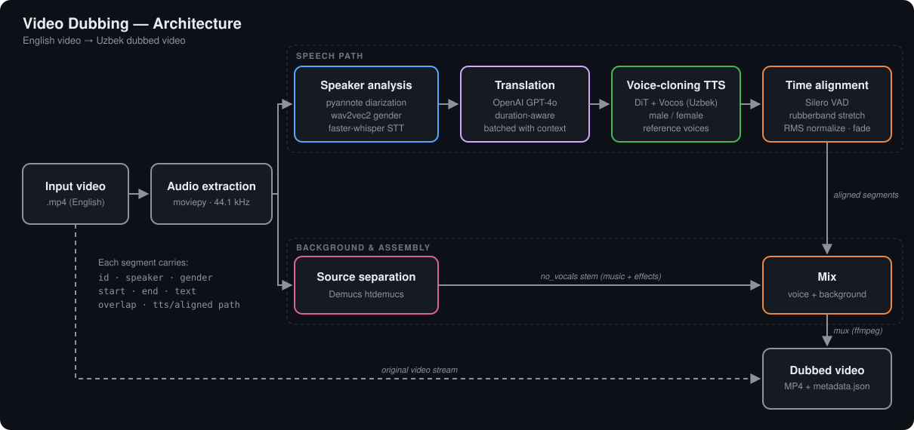

# Uzbek AI Dubbing

**Automatic English → Uzbek video dubbing with speaker-aware voice cloning.**

Give it an English video and it returns the same video spoken in Uzbek. Each speaker gets a male or female Uzbek voice, every line is timed to the original, and the background music and sound effects are kept.



---

## Features

- **Speaker diarization.** [pyannote](https://github.com/pyannote/pyannote-audio) works out *who* speaks *when*.
- **Gender detection.** A wav2vec2 classifier checks each speaker so the right voice is used.
- **Speech-to-text.** [faster-whisper](https://github.com/SYSTRAN/faster-whisper) `large-v2` with built-in VAD.
- **Duration-aware translation.** An OpenAI GPT model gets each line together with its time budget, so the Uzbek text fits the same slot. Lines are sent in batches so context carries across sentences.
- **Uzbek voice-cloning TTS.** An F5-TTS-style DiT model with the Vocos vocoder, trained for Uzbek, with a separate reference voice per gender.
- **Time alignment.** The length of the generated speech is measured with Silero VAD and stretched to fit using rubberband, with a librosa fallback. The output is then loudness-normalized and faded in and out.
- **Background preservation.** [Demucs](https://github.com/facebookresearch/demucs) separates the music and effects stem and mixes it back under the new voice.
- **Overlap handling.** Segments that overlap another speaker are detected and left out of dubbing so voices don't pile up.
- **Reproducible output.** Every run writes a `metadata.json` with timings, speakers, the source text and the translation.

## How it works

| # | Stage | Module | Tooling |
|---|---|---|---|
| 1 | Extract audio from the video | `dubbing/media.py` | moviepy / ffmpeg |
| 2 | Diarization, gender detection and STT; transcripts matched to speakers, merged and checked for overlap | `dubbing/speaker_analysis.py` | pyannote, wav2vec2, faster-whisper |
| 3 | Translate with a time budget per segment | `dubbing/translation.py` | OpenAI Chat Completions (JSON mode) |
| 4 | Synthesize Uzbek speech per segment | `dubbing/tts/synthesizer.py` | DiT + Vocos |
| 5 | Stretch and fit each clip to its time slot | `dubbing/alignment.py` | Silero VAD, rubberband |
| 6 | Separate the background | `dubbing/media.py` | Demucs `htdemucs` |
| 7 | Mix voice and background, mux into the video | `dubbing/media.py` | pydub, moviepy |

`dubbing/pipeline.py` orchestrates all stages. Each segment flows through the pipeline as a plain dict:

```json
{
  "id": 3,
  "speaker": "SPEAKER_01",
  "gender": "female",
  "start": 13.56,
  "end": 16.45,
  "source_text": "I never thought I'd see you here.",
  "text": "Seni bu yerda ko'raman deb o'ylamagandim.",
  "overlap": false,
  "tts_path": "outputs/.../tts/003_SPEAKER_01_female.wav",
  "aligned_path": "outputs/.../aligned/003_aligned.wav"
}
```

## Project structure

```
.
├── dubbing/                 # Python package
│   ├── __main__.py          # CLI: python -m dubbing
│   ├── config.py            # Config dataclass, reads .env
│   ├── pipeline.py          # DubbingPipeline orchestrator
│   ├── speaker_analysis.py  # diarization, gender, STT, merging
│   ├── translation.py       # duration-aware LLM translation
│   ├── alignment.py         # VAD-based time stretching
│   ├── media.py             # extract / demucs / mix / mux
│   ├── cuda_libs.py         # cuDNN preload for faster-whisper
│   └── tts/
│       ├── synthesizer.py   # Synthesizer (model + voice cache)
│       └── uvc/             # DiT model, inference, Uzbek text normalization
├── configs/tts.yaml         # TTS checkpoint + reference voices
├── models/                  # model weights (checkpoint is git-ignored)
├── assets/voices/           # reference voice recordings (git-ignored)
├── examples/                # input videos (git-ignored)
├── outputs/                 # pipeline results (git-ignored)
├── docs/architecture.svg
├── requirements.txt         # direct dependencies
└── requirements-lock.txt    # full pinned environment
```

## Installation

**Requirements:** Linux or WSL2, Python 3.10, an NVIDIA GPU (tested on an RTX 3090, 24 GB) and `ffmpeg`. The `rubberband` CLI is optional and gives higher-quality time stretching.

```bash
git clone https://github.com/RifatMamayusupov/uzbek-ai-dubbing.git
cd uzbek-ai-dubbing

python3.10 -m venv env
source env/bin/activate
pip install -r requirements.txt

sudo apt install ffmpeg rubberband-cli
```

### Model weights

1. Download the Uzbek TTS checkpoint (~5 GB) from [Google Drive](https://drive.google.com/file/d/1yvQ4MOkwDuvCh8p0BfU5U5CgTLKFSARk/view?usp=sharing) and save it as `models/uvc/model_last.pt`.
2. Put a short (≤ 15 s) male and female reference recording in `assets/voices/`. Register each one in `configs/tts.yaml` with its **exact** transcript.
3. Accept the terms of [`pyannote/speaker-diarization-community-1`](https://huggingface.co/pyannote/speaker-diarization-community-1) on Hugging Face.

The Whisper, wav2vec2, Vocos, Silero and Demucs models download automatically on the first run.

### Credentials

```bash
cp .env.example .env
# then fill in HF_TOKEN and OPENAI_API_KEY
```

## Usage

```bash
python -m dubbing examples/my_video.mp4
```

| Option | Default | Description |
|---|---|---|
| `-o, --output-dir` | `outputs/<video name>` | Working and output directory |
| `--num-speakers N` | auto | Set this when you know the exact number of speakers |
| `--source-lang` | `en` | Whisper source language |
| `--target-lang` | `Uzbek` | Translation target |
| `--device` | auto | `cuda` or `cpu` |
| `--cleanup` | off | Delete intermediate files when finished |
| `-v, --verbose` | off | Debug logging |

Output layout:

```
outputs/my_video/
├── output/DUBBED_my_video.mp4   # final video
├── output/final_audio.wav
├── output/metadata.json
├── chunks/   # original audio per segment
├── tts/      # raw TTS per segment
├── aligned/  # time-fitted TTS per segment
└── temp/     # extracted audio, demucs stems
```

### Python API

```python
from dubbing.config import Config
from dubbing.pipeline import DubbingPipeline

config = Config(num_speakers=2)
pipeline = DubbingPipeline("outputs/interview", config)
video_path, segments = pipeline.run("examples/interview.mp4")
```

## Configuration

`dubbing/config.py` holds every tunable setting. The most useful ones are:

| Setting | Default | Effect |
|---|---|---|
| `merge_gap_threshold` | 0.5 s | Merge same-speaker segments closer than this |
| `min_segment_duration` | 0.3 s | Drop shorter segments |
| `overlap_threshold` | 0.3 | Skip a segment when more than 30% of it overlaps another speaker |
| `min_stretch_rate` / `max_stretch_rate` | 0.6 / 1.5 | Limits on time stretching |
| `expected_speech_ratio` | 0.7 | Share of a slot the TTS speech should fill |
| `voice_boost_db` / `background_reduction_db` | 2 / 0 | Mix levels |
| `translation_model` | `gpt-4o` | Override with `OPENAI_MODEL` in `.env` |

Voice speed and reference voices live in `configs/tts.yaml`.

## Limitations

- The pipeline expects English source audio, because the translation prompt is written for English → target.
- Overlapping speech is skipped rather than dubbed.
- There is one reference voice per gender, so two speakers of the same gender sound alike.
- A time-stretch factor outside 0.6–1.5× is clamped, which can cut off very long translations.

## Roadmap

- [ ] Per-speaker voice cloning from the original audio
- [ ] Lip-sync post-processing
- [ ] Subtitle (SRT) export
- [ ] Web UI / REST API
- [ ] Docker image

## Acknowledgements

This project builds on [pyannote.audio](https://github.com/pyannote/pyannote-audio), [faster-whisper](https://github.com/SYSTRAN/faster-whisper), [F5-TTS](https://github.com/SWivid/F5-TTS), [Vocos](https://github.com/gemelo-ai/vocos), [Silero VAD](https://github.com/snakers4/silero-vad) and [Demucs](https://github.com/facebookresearch/demucs).

## Author

**Rifat Mamayusupov** — [@RifatMamayusupov](https://github.com/RifatMamayusupov)
